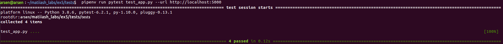
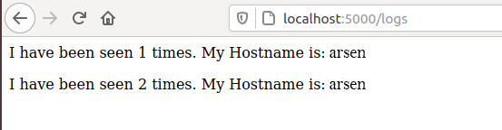
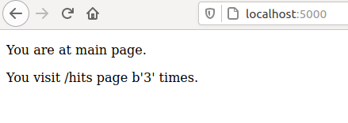

# Lab5
### 1. Ознайомився з docker-compose.
### 2. Ознайомився з бібліотекою Flask.
### 3. Створив папку my_app, tests. Скопіював файли з репозиторію matiiash_labs.
### 4. Виконав наступні команди:
####pip3 install redis
####pipenv --python 3.8
####pipenv install -r requirements.txt
####pipenv run python app.py
### 5. Відкривши нову вкладку терміналу я запустив наступну команду:
####pipenv run pytest test_app.py --url http://localhost:5000
### 6. Створив папку logs (в папці з додатком), в якій створив файл app.log
#### 
### 7. Видалив файли, які були створені після тестового запуску, а також створив файли => Dockerfile, Makefile
### 8. Опис директив мейкфайлу:
#### docker-prune - видалення контейнерів, волюмів, мереж та імеджів
#### run - директива для створення мережі
#### PHONY - дозволяє оголошувати фальшиві цілі
#### STATES - змінна для збереження директив
#### test-app - директива для запуску контейнера з тестами
#### $(STATES) - директива для білда контейнера
#### REPO - змінна для збереження назви Docker репозиторію
### 9. Запустив додаток та переконався, що він робочий
#### 
#### 
### 10. Створив директиву push - слугує для завантаження імеджів у Docker Hub репозиторій
### 11. Cтворив директиву remove для видалення локальних імеджів.
### 12. Я створив компоуз файл,в якому було створено дві мережі(public та secret). Запустив docker-compose.
### 13.Сайт працює. Адреса: localhost:80
### 15. Змінив тег імейджів, перезапустив docker-compose та почистив імейджі за допомогою remove
### 16. Зупинив проект (Сtrl+C), очистив ресурси створені компоузом.
### 17. За допомогою команди docker-compose push завантажив створені імеджі в репозиторій.
### 19. Створив docker-compose.yml для лабораторної №4
